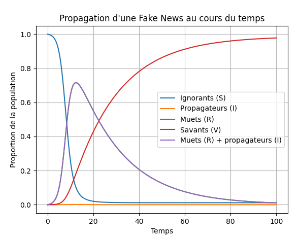
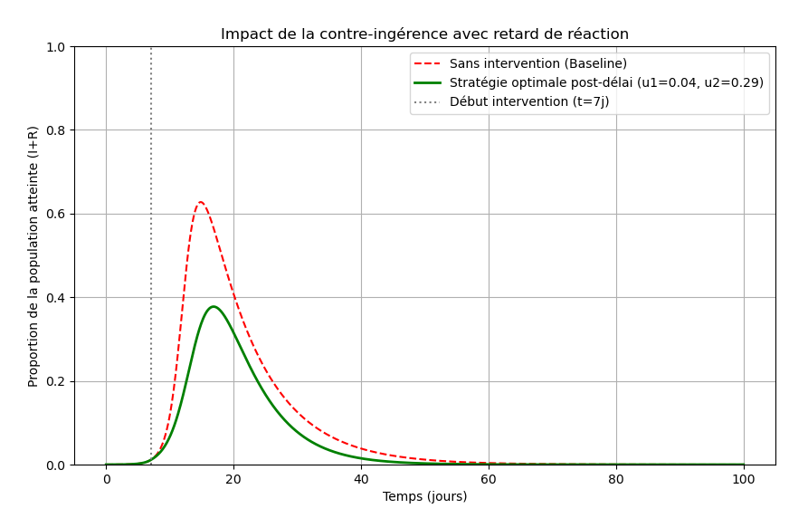

# Modélisation Épidémiologique de la Fuite d'Information 🦠📈

**Application aux stratégies de contre-ingérence sur les réseaux sociaux.**
* **Auteur :** Arnaud Stienon
* **Institution :** UCLouvain - EPL
* **Date :** Février 2026

## 🎯 Contexte et Objectif
Les fausses informations ("fake news") se propagent sur les réseaux sociaux de la même manière qu'une maladie contagieuse. Ce projet propose d'utiliser la modélisation épidémiologique en adaptant le modèle classique SIR (Susceptibles, Infectés, Retirés) pour simuler la propagation d'une rumeur (particulièrement calibrée pour le réseau X) et évaluer quantitativement l'efficacité des différentes contre-mesures étatiques.

L'objectif est purement mathématique : optimiser l'allocation budgétaire entre la censure et la prévention pour étouffer la rumeur.

## 🧠 Le Modèle Compartimental
La population ciblée est divisée en 4 compartiments distincts :
* $S(t)$ **(Les Ignorants)** : Population n'ayant pas encore vu la fuite.
* $I(t)$ **(Les Propagateurs)** : Individus partageant activement l'information.
* $R(t)$ **(Les Muets)** : Individus croyant l'information mais ne la propageant pas.
* $V(t)$ **(Les Savants)** : Individus connaissant l'information mais n'y croyant pas (ou sachant qu'elle est fausse).

### Le Système Dynamique
Le transfert de population entre ces états est régi par le système d'équations différentielles ordinaires suivant :

$$\frac{dS}{dt}=-\beta SI$$
$$\frac{dI}{dt}=\alpha\beta SI-\gamma_{2}I$$
$$\frac{dR}{dt}=\beta SI(1-\alpha)-\gamma_{1}R+\gamma_{2}I$$
$$\frac{dV}{dt}=\gamma_{1}R$$

*Avec :*
* $\beta$ : Le taux de transmission (portée/contagion).
* $\alpha$ : Le taux de personnes atteintes devenant propagateurs (clivance).
* $\gamma_{1}$ : Le taux de passage de Muet à Savant (prise de conscience / fact-checking).
* $\gamma_{2}$ : Le taux d'abandon de la propagation (perte d'intérêt / modération).

Le taux de reproduction de base déterminant si la rumeur s'étend est $R_0=\frac{\beta\alpha}{\gamma_{2}}$.

## 🛡️ Optimisation et Contre-mesures
Le projet modélise l'intervention de l'État via deux leviers sous contrainte d'un budget fixe :
1. **La modération/censure ($u_2$) :** Bannissement des comptes, impactant $\gamma_2$ avec un coût linéaire.
2. **La prévention ($u_1$) :** Campagnes de sensibilisation, impactant $\gamma_1$ avec un coût quadratique.

Les simulations montrent qu'une combinaison des deux permet de réduire le pic d'infection, mais que l'efficacité dépend drastiquement de $t_{delay}$, le délai de réaction avant le début de l'intervention.

## 📈 Aperçu des résultats



## 🗂️ Structure du Dépôt
* `FakeNews.pdf` : Rapport complet incluant l'analyse théorique (points d'équilibre, stabilité locale) et la discussion complète des paramètres.
* `simulation.py` : Script de résolution du système d'EDO via `scipy.integrate.odeint`.
* `optimisation.py` : Algorithme de minimisation sous contrainte budgétaire utilisant `scipy.optimize.minimize` (SLSQP).

## ⚙️ Utilisation
Les scripts requièrent Python et les librairies suivantes :

```bash
pip install numpy scipy matplotlib
